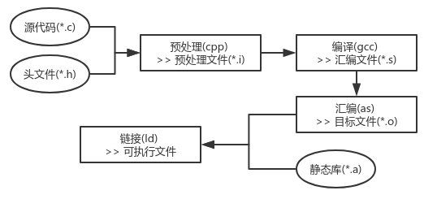
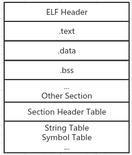

# 编译

##　一、系统环境

- CPU：Intel(R) Core(TM) i5-5200U CPU @ 2.20GHz

- 操作系统：Ubuntu 18.04.2 LTS
- 内核版本：Linux version 4.18.0-25-generic
- GNU GCC版本：gcc version 7.4.0 (Ubuntu 7.4.0-1ubuntu1~18.04.1)
  - C standard revision：C11
  - **GNU Compiled BY**
    - GMP version： 6.1.2
    - MPFR version ：4.0.1
    - MPC version ： 1.1.0
    - isl version ： isl-0.19-GMP
- GNU 汇编器版本：2.30 (x86_64-linux-gnu) using BFD version (GNU Binutils for Ubuntu) 2.30

- 链接器版本：
  - [collect2](https://gcc.gnu.org/onlinedocs/gccint/Collect2.html) version：7.4.0 
    - gcc一般是collect2,而不是ld，collect2 是ld链接器的一个封装，最终还是调用ld来完成链接工作
    - collect2通过**第一次链接**程序查看链接器输出文件来查找具有特定名称表明是构造函数的符号，如果找得到则会创建一个新的临时‘.c’文件包含这些符号，然后编译这个文件并**第二次链接**程序.The program collect2 works by linking the program once and looking through the linker output file for symbols with particular names indicating they are constructor functions. If it finds any, it creates a new temporary ‘.c’ file containing a table of them, compiles it, and links the program a second time including that file.）
  - GNU ld (GNU Binutils for Ubuntu)：2.30

## 二、GCC编译过程

### 2.1 GCC编译过程



1. 预处理

   - 删除所有的#define，展开所有的宏定义
   - 处理所有的条件预编译指令<#if,#endif,#ifdef,#ifndef,#elif,#else>
   - 处理#include预编译指令，将包含的文件插入到include的位置（递归进行）
   - 删除所有的注释
   - 添加行号和文件名标识（调试时使用）
   - 保留所有的#pragma编译器指令（编译器需要使用这些指令）

   ```bash
   # 单独产生预处理后的文件（本模块假设hello.c是源代码程序,hello.i是hello.c预处理后的文件,hello.s是hello.c编译后的文件，hello.o是hello.c汇编后的文件，hello是hello.c最终的可执行程序）
   
   # 使用gcc命令产生预处理文件
   $ gcc -E hello.c -o hello.i
   
   # 使用cpp命令产生预处理文件
   $ cpp hello.c > hello.i
   ```

2. 编译：将预处理完的文件进行一系列的词法分析、语法分析、语义分析、中间代码生成、目标代码生成与优化之后产生相应的汇编代码文件

   - 词法分析：扫描器运行类似于有限状态机的算法将代码的字符序列分割成一系列的记号
   - 语法分析：语法分析器对扫描器产生的记号进行语法分析，从而产生语法树（以表达式为节点的树）
   - 语义分析：语义分析器确定语句的意义（比如两个指针做乘法是没有意义的），编译器只能分析静态语义（在编译时能够确定的语义，通常包括声明和类型的匹配，类型的转换；与之相对的动态语义是在运行时才能确定的语义，例如将0作为除数是一个运行期语义错误）

   ```bash
   # 编译预处理后的文件产生汇编代码文件
   $ gcc -S hello.i -o hello.s
   
   # 编译源文件产生汇编代码文件
   $ gcc -S hello.c -o hello.s
   
   # 现在的gcc编译器将预处理和编译两个步骤合成了一个步骤，使用一个叫cc1的程序来完成这个过程
   $ /usr/lib/gcc/x86_64-linux-gnu/7/cc1 hello.c -o hello.s
   ```

3. 汇编：将汇编代码转变成机器可以执行的指令（根据汇编指令和机器指令的对照表一一翻译）

   ``` bash
   # 使用as处理汇编文件产生目标文件
   $ as hello.s -o hello.o
   
   # 使用gcc处理汇编文件产生目标文件
   $ gcc -c hello.s -o hello.o
   
   # 使用gcc处理源文件产生目标文件
   $ gcc -c hello.c -o hello.o
   ```

4. 链接：将目标文件链接到一起形成可执行文件,主要包括地址和空间分配，符号决议，和重定位等步骤

   - 符号决议：也叫做符号绑定、名称绑定、名称决议等等。从细节上来讲，决议更倾向于静态链接，绑定更倾向与动态链接

   - 重定位：编译一个文件时不知道一个要调用的函数或者需要操作的一个变量的地址，就会把这些调用函数或者操作变量的指令目标地址搁置，等到最后链接的时候由链接器去将这些指令的目标地址修正，这个地址修正的过程也被叫做**重定位**，每一个需要修正的地方叫做**重定位入口**。


### 2.2 实际编译过程

1. 使用如下样例，包含hello.c和func.c两个源文件（之后也是用这两个文件进行分析）

   ```c
   /* hello.c：主测试程序，包括全局静态变量，局部静态变量，全局变量，局部变量，基本的函数调用 */
   // export var
   extern int export_func_var;
   
   // global var
   int global_uninit_var;
   int global_init_var_0 = 0;
   int global_init_var_1 = 1;
   
   // const var
   const char *const_string_var = "const string";
   
   // static global var
   static int static_global_uninit_var;
   static int static_global_init_var_0 = 0;
   static int static_global_init_var_1 = 1;
   
   // func header
   void func_call_test(int num);
   
   int main(void){
       // local var
       int local_uninit_var;
       int local_init_var_0 = 0;
       int local_init_var_1 = 1;
   
       // static local var
       static int static_local_uninit_var;
       static int static_local_init_var_0 = 0;
       static int static_local_init_var_1 = 1;
   
       // call func
       func_call_test(8);
   
       // export var op
       export_func_var = export_func_var * 2;
   
       return 0;
   }
   ```

   ```c
   /* func.c：包含一个简单的被调用函数和一个全局变量 */
   int export_func_var = 666;
   
   void func_call_test(int num){
       int double_num = num * 2;
   }
   ```
2. 使用`gcc -v hello.c func.c`编译生成可执行文件a.out，产生如下输出（简化版本）

   ```bash
   [delta@delta: code ]$ gcc -v func.c hello.c
   
   # 对func.c的预处理和编译过程
   /usr/lib/gcc/x86_64-linux-gnu/7/cc1 func.c -o /tmp/ccfC6J5E.s
   # 对func.c产生的.s文件汇编产生二进制文件
   as -v --64 -o /tmp/ccF4Bar0.o /tmp/ccfC6J5E.s
   
   # 对hello.c的预处理和编译过程
   /usr/lib/gcc/x86_64-linux-gnu/7/cc1 hello.c -o /tmp/ccfC6J5E.s
   # 对hello.c产生的.s文件汇编产生二进制文件
   as -v --64 -o /tmp/cc7UmhQl.o /tmp/ccfC6J5E.s
   
   # 链接过程
   /usr/lib/gcc/x86_64-linux-gnu/7/collect2 -dynamic-linker ld-linux-x86-64.so.2 Scrt1.o crti.o crtbeginS.o /tmp/ccF4Bar0.o /tmp/cc7UmhQl.o crtendS.o crtn.o
   ```

   

## 三、链接过程解析

***Q:***

- *目标文件的格式是怎样的？*

- *多个目标是如何链接到一起的？*

  

### 3.1 目标文件

#### 3.1.1目标文件类型

- Window下的PE（Portable Executable）
- Linux下的ELF（Executable Linkable Format）

*注：*

1. *PE和ELF格式都是COFF（Common file format）格式的变种*
2. *目标文件与可执行文件的内容和结构类似，所以一般采用相同的格式存储。广义上来可以将目标文件和可执行文件看做是同一种类型的文件，在window下统称它们为PE-COFF文件格式，在Linux下统称它们为ELF文件。*
3. *不止是可执行文件按照可执行文件格式存储，动态链接库（DLL，Dynamic Linking Library）（Window的.dll和Linux的.so）以及静态链接库（Static Linking Library）（Window的.lib和Linux的.a）文件都按照可执行文件的格式存储。（静态链接库稍有不同，它是把很多的目标文件捆绑在一起形成一个文件，再加上一些索引。可以理解为一个包含很多目标文件的文件包）*

#### 3.1.2 ELF文件类型

| ELF文件类型                        | 说明                                                         | 实例                               |
| :--------------------------------- | :----------------------------------------------------------- | ---------------------------------- |
| 可重定位文件（Relocatable File）   | 包含代码和数据，可以被用来链接成可执行文件或者共享目标文件，静态链接库可以归为这一类 | Linux的.o，Window下的.obj          |
| 可执行文件（Executable File）      | 包含可以直接执行的程序，一般没有扩展名                       | Linux的/bin/bash文件，Window的.exe |
| 共享目标文件（Shared Object File） | 包含代码和数据，链接器可以上映这种文件与其他可重定位文件和共享目标文件进行链接产生新的目标文件；动态链接器可以将几个共享目标文件与可执行文件结合，作为进程映像的一部分来运行 | Linux的.so，Window的.dll           |
| 核心转储文件（Core Dump File）     | 进程意外终止时，系统将该进程的地址空间的内容以及终止时的其它信息转储到核心转储文件 | Linux下的core dump                 |

#### 3.1.3目标文件结构

目标文件中包含编译后的指令代码、数据，还包括了链接时需要的一些信息（符号表，调试信息和字符串等），一般目标文件将这些信息按照不同的属性，以**节（Section）**的形式存储（有时也称为**段（Segment)**）。如下图所示



##### 3.1.3.1**常见的段**

| 段名        | 说明                                                         |
| :---------- | ------------------------------------------------------------ |
| .text/.code | 代码段，编译后的机器指令                                     |
| .data       | 数据段，全局变量和局部静态变量                               |
| .bss        | 未初始化的全局变量和局部静态变量（.bss段只是为未初始化的全局变量和局部静态变量预留位置） |
| .rodata     | 只读信息段                                                   |
| .rodata1    | 存放只读数据，字符串常量，全局const变量。与.rodata一样       |
| .comment    | 编译器版本信息                                               |
| .debug      | 调试信息                                                     |
| .dynamic    | 动态链接信息                                                 |
| .hash       | 符号哈希表                                                   |
| .line       | 调试时的行号表，即源代码行号与编译后的指令的对应表           |
| .note       | 额外的编译器信息。程序的公司名，发布版本号                   |
| .strtab     | String Table，字符串表，用来存储ELF文件中用到的各种字符串    |
| .symtab     | Symbol Table，符号表                                         |
| .shstrtab   | Section String Table，段名表                                 |
| .plt/.got   | 动态链接的跳转表和全局入口表                                 |
| .init/.fini | 程序初始化与终结代码段                                       |


##### 3.1.3.2目标文件结构分析

1. ELF文件头：

   - 使用`gcc -c hello.c -o hello.o`生成目标文件hello.o，并使用`readelf -h hello.o`读取目标文件的ELF文件头，可以看出ELF文件头定义了**ELF魔数、文件机器字节长度、数据存储方式、版本，运行平台、ABI版本、ELF重定位类型、硬件平台、硬件平台版本、入口地址、程序入口和长度、段表的位置和长度及段的数量**等，如下图所示

     ```bash
     ELF Header:
       Magic:   7f 45 4c 46 02 01 01 00 00 00 00 00 00 00 00 00 
       Class:                             ELF64
       Data:                              2's complement, little endian
       Version:                           1 (current)
       OS/ABI:                            UNIX - System V
       ABI Version:                       0
       Type:                              REL (Relocatable file)
       Machine:                           Advanced Micro Devices X86-64
       Version:                           0x1
       Entry point address:               0x0
       Start of program headers:          0 (bytes into file)
       Start of section headers:          1328 (bytes into file)
       Flags:                             0x0
       Size of this header:               64 (bytes)
       Size of program headers:           0 (bytes)
       Number of program headers:         0
       Size of section headers:           64 (bytes)
       Number of section headers:         15
       Section header string table index: 14
     ```

   - ELF文件头结构体定义在/usr/include/elf.h中，目标文件hello.o的文件头中机器字节长度为ELF64，找到64位版本文件头结构体Elf64_Ehdr定义，如下所示

     ```c
     typedef struct
     {
       unsigned char	e_ident[EI_NIDENT];	/* Magic number and other info */
       Elf64_Half	e_type;				/* Object file type */
       Elf64_Half	e_machine;			/* Architecture */
       Elf64_Word	e_version;			/* Object file version */
       Elf64_Addr	e_entry;			/* Entry point virtual address */
       Elf64_Off		e_phoff;			/* Program header table file offset */
       Elf64_Off		e_shoff;			/* Section header table file offset */
       Elf64_Word	e_flags;			/* Processor-specific flags */
       Elf64_Half	e_ehsize;			/* ELF header size in bytes */
       Elf64_Half	e_phentsize;		/* Program header table entry size */
       Elf64_Half	e_phnum;			/* Program header table entry count */
       Elf64_Half	e_shentsize;		/* Section header table entry size */
       Elf64_Half	e_shnum;			/* Section header table entry count */
       Elf64_Half	e_shstrndx;			/* Section header string table index */
     } Elf64_Ehdr;
     ```

   - 除结构体中的e_ident对应到readelf输出的从Magic到ABI Version部分，其它都是一一对应关系

   - `e_shstrndx`变量表示`.shstrtab`在段表中的下标

     

2. 段表

   - 使用`gcc -c hello.c -o hello.o`生成目标文件hello.o，并使用`readelf -S hello.o`读取目标文件的段表部分

     ```bash
     Section Headers:
       [Nr] Name              Type             Address           Offset
            Size              EntSize          Flags  Link  Info  Align
       [ 0]                   NULL             0000000000000000  00000000
            0000000000000000  0000000000000000           0     0     0
       [ 1] .text             PROGBITS         0000000000000000  00000040
            0000000000000035  0000000000000000  AX       0     0     1
       [ 2] .rela.text        RELA             0000000000000000  00000440
            0000000000000048  0000000000000018   I      12     1     8
       [ 3] .data             PROGBITS         0000000000000000  00000078
            000000000000000c  0000000000000000  WA       0     0     4
       [ 4] .bss              NOBITS           0000000000000000  00000084
            0000000000000014  0000000000000000  WA       0     0     4
       [ 5] .rodata           PROGBITS         0000000000000000  00000084
            000000000000000d  0000000000000000   A       0     0     1
       [ 6] .data.rel.local   PROGBITS         0000000000000000  00000098
            0000000000000008  0000000000000000  WA       0     0     8
       [ 7] .rela.data.rel.lo RELA             0000000000000000  00000488
            0000000000000018  0000000000000018   I      12     6     8
       [ 8] .comment          PROGBITS         0000000000000000  000000a0
            000000000000002c  0000000000000001  MS       0     0     1
       [ 9] .note.GNU-stack   PROGBITS         0000000000000000  000000cc
            0000000000000000  0000000000000000           0     0     1
       [10] .eh_frame         PROGBITS         0000000000000000  000000d0
            0000000000000038  0000000000000000   A       0     0     8
       [11] .rela.eh_frame    RELA             0000000000000000  000004a0
            0000000000000018  0000000000000018   I      12    10     8
       [12] .symtab           SYMTAB           0000000000000000  00000108
            0000000000000240  0000000000000018          13    16     8
       [13] .strtab           STRTAB           0000000000000000  00000348
            00000000000000f6  0000000000000000           0     0     1
       [14] .shstrtab         STRTAB           0000000000000000  000004b8
            0000000000000076  0000000000000000           0     0     1
     Key to Flags:
       W (write), A (alloc), X (execute), M (merge), S (strings), I (info),
       L (link order), O (extra OS processing required), G (group), T (TLS),
       C (compressed), x (unknown), o (OS specific), E (exclude),
       l (large), p (processor specific)
     ```

   - 段表结构体定义在/usr/include/elf.h中，目标文件hello.o的文件头中机器字节长度为ELF64，找到64位版本段表结构体定义Elf64_Shdr（每个Elf64_Shdr对应一个段，Elf64_Shdr又称为**段描述符<Section Descriptor>**），如下所示

     ```c
     typedef struct
     {
       Elf64_Word	sh_name;		/* Section name (string tbl index) */
       Elf64_Word	sh_type;		/* Section type */
       Elf64_Xword	sh_flags;		/* Section flags */
       Elf64_Addr	sh_addr;		/* Section virtual addr at execution */
       Elf64_Off		sh_offset;		/* Section file offset */
       Elf64_Xword	sh_size;		/* Section size in bytes */
       Elf64_Word	sh_link;		/* Link to another section */
       Elf64_Word	sh_info;		/* Additional section information */
       Elf64_Xword	sh_addralign;	/* Section alignment */
       Elf64_Xword	sh_entsize;		/* Entry size if section holds table */
     } Elf64_Shdr;
     ```

   - Elf64_Shdr部分成员解释

     | 变量名           | 说明                                                         |
     | ---------------- | ------------------------------------------------------------ |
     | sh_name          | 段名是一个字符串，位于一个叫.shstrtab的字符串表中，sh_name是段名字符串在.shstrtab中的偏移 |
     | sh_addr          | 段虚拟地址，如果该段可以加载，sh_addr为该段被加载后在进程地址空间的虚拟地址，否则为0 |
     | sh_offset        | 段偏移，如果该段存在于文件中则表示该段在文件中的偏移，否则无意义 |
     | sh_link、sh_info | 段链接信息，如果该段的类型是与链接相关的，则该字段有意义     |
     | sh_addralign     | 段地址对齐，sh_addralign表示是地址对齐数量的指数，如果sh_addralign为0或者1则该段没有字节对齐要求 |
     | sh_entsize       | 对于一些段包含了一些固定大小的项，比如符号表，则sh_entsize表示每个项的大小 |

     

3. 重定位表：hello.o中包含一个`.rela.text`的段，类型为RELA，它是一个重定位表。链接器在处理目标文件时必须对文件中的某些部位进行重定位，这些重定位信息都记录在重定位表中。对于每个需要重定位的代码段或者数据段，都会有一个相应的重定位表。

   

4. 字符串表

   - .strtab：字符串表，保存普通的字符串，比如符号的名字

   - .shstrtab：段表字符串表，保存段表中用到的字符串，比如段名

     

   **结论：ELF文件头中的`e_shstrndx`变量表示`.shstrtab`在段表中的下标，`e_shoff`表示段表在文件中的偏移，只有解析ELF文件头，就可以得到段表和段表字符串表的位置，从而解析整个ELF文件**


#### 3.1.4 链接的接口——符号

##### 3.1.4.1 符号定义

1. **定义：**在链接中，目标文件之间相互拼合实际上是目标文件之间对地址的引用，即对函数和变量地址的引用。在链接中，将函数和变量统称为**符号（Symbol）**，函数名或变量名称为**符号名（Symbol Name）**。

2. 每个目标文件都有一个符号表记录了目标文件中用到的所有符号（每个定义的符号都有一个符号值，对于函数和变量来说，符号值就是它们的地址），**常见分类**如下

   | 符号类型                                           | 说明                                     |
   | -------------------------------------------------- | ---------------------------------------- |
   | 定义在本目标文件中的全局符号                       | 可以被其它目标文件引用的符号             |
   | 在本目标文件中引用的符号，却没有定义在本目标文件中 | 外部符号（External Symbol）              |
   | 段名，由编译器产生                                 | 它的值就是该段的起始地址                 |
   | 局部符号                                           | 只在编译单元内部可见，链接器往往忽略它们 |
   | 行号信息                                           | 目标文件指令与代码行的对应关系，可选     |

##### 3.1.4.2 符号结构分析

- 符号表结构：符号表结构体定义在/usr/include/elf.h中，如下所示

  ```c
  typedef struct
  {
    Elf64_Word	st_name;		/* Symbol name (string tbl index) */
    unsigned char	st_info;		/* Symbol type and binding */
    unsigned char st_other;		/* Symbol visibility */
    Elf64_Section	st_shndx;		/* Section index */
    Elf64_Addr	st_value;		/* Symbol value */
    Elf64_Xword	st_size;		/* Symbol size */
  } Elf64_Sym;
  ```

  Elf64_Sym成员解释

  | 变量名   | 说明                     |
  | -------- | ------------------------ |
  | st_name  | 符号名在字符串表中的下标 |
  | st_info  | 符号类型和绑定信息       |
  | st_other | 符号可见性               |
  | st_shndx | 符号所在的段             |
  | st_value | 符号对应的值             |
  | st_size  | 符号大小                 |

- 使用`gcc -c hello.c -o hello.o`生成目标文件hello.o，并使用`readelf -s hello.o`读取目标文件的符号表部分

  ```bash
  Symbol table '.symtab' contains 24 entries:
     Num:    Value          Size Type    Bind   Vis      Ndx Name
       0: 0000000000000000     0 NOTYPE  LOCAL  DEFAULT  UND 
       1: 0000000000000000     0 FILE    LOCAL  DEFAULT  ABS hello.c
       2: 0000000000000000     0 SECTION LOCAL  DEFAULT    1 
       3: 0000000000000000     0 SECTION LOCAL  DEFAULT    3 
       4: 0000000000000000     0 SECTION LOCAL  DEFAULT    4 
       5: 0000000000000000     0 SECTION LOCAL  DEFAULT    5 
       6: 0000000000000000     0 SECTION LOCAL  DEFAULT    6 
       7: 0000000000000004     4 OBJECT  LOCAL  DEFAULT    4 static_global_uninit_var
       8: 0000000000000008     4 OBJECT  LOCAL  DEFAULT    4 static_global_init_var_0
       9: 0000000000000004     4 OBJECT  LOCAL  DEFAULT    3 static_global_init_var_1
      10: 0000000000000008     4 OBJECT  LOCAL  DEFAULT    3 static_local_init_var_1.1
      11: 000000000000000c     4 OBJECT  LOCAL  DEFAULT    4 static_local_init_var_0.1
      12: 0000000000000010     4 OBJECT  LOCAL  DEFAULT    4 static_local_uninit_var.1
      13: 0000000000000000     0 SECTION LOCAL  DEFAULT    9 
      14: 0000000000000000     0 SECTION LOCAL  DEFAULT   10 
      15: 0000000000000000     0 SECTION LOCAL  DEFAULT    8 
      16: 0000000000000004     4 OBJECT  GLOBAL DEFAULT  COM global_uninit_var
      17: 0000000000000000     4 OBJECT  GLOBAL DEFAULT    4 global_init_var_0
      18: 0000000000000000     4 OBJECT  GLOBAL DEFAULT    3 global_init_var_1
      19: 0000000000000000     8 OBJECT  GLOBAL DEFAULT    6 const_string_var
      20: 0000000000000000    53 FUNC    GLOBAL DEFAULT    1 main
      21: 0000000000000000     0 NOTYPE  GLOBAL DEFAULT  UND _GLOBAL_OFFSET_TABLE_
      22: 0000000000000000     0 NOTYPE  GLOBAL DEFAULT  UND func_call_test
      23: 0000000000000000     0 NOTYPE  GLOBAL DEFAULT  UND export_func_var
  ```

  ```bash
  注：
  	1. static_global_uninit_var、static_local_init_var_0和static_local_uninit_var、static_global_init_var_0和global_init_var_0在bss段（因为初始化为0和不初始化是一样的）
  	2. static_global_init_var_1、static_local_init_var_1和global_init_var_1在data段（初始化的全局变量）
  	3. static变量的类型均为LOCAL，表明该符号只为该目标文件内部可见；非Static全局变量的类型为GLOBAL，表明该符号外部可见
  	4. 在hello.c中引用了func_call_test和export_func_var符号，但是没有定义，所以它的Ndx是UND（注：export一个变量但是并未使用则符号表中不会出现这个边浪符号信息；export一个不存在的变量但是并未使用编译不会报错；export一个不存在的变量并使用会报错 <**注意系统环境**> ）
  	5. 未初始化的全局非静态变量global_uninit_var在COM块中
  	6. const_string_var在.data.rel.local段中
  ```

- 特殊符号：当使用**链接器生成可执行文件时**，会定义很多特殊的符号，这些符号并未在程序中定义，但是可以直接声明并引用它们

##### 3.1.4.3 符号修饰与函数签名

​		符号修饰与函数签名：在符号名前或者后面加上`_`修饰符号，防止与库文件和其它目标文件冲突。现在的linux下的GCC编译器中，默认情况下去掉了加上`_`这种方式，可以通过参数选项打开

- C++符号修饰：C++拥有类，继承，重载和命名空间等这些特性，导致符号管理更为复杂。例如重载的情况：函数名相同但是参数不一样。然后就有了符号修饰和符号改编的机制，使用函数签名（包括函数名，参数类型，所在的类和命名空间等信息）来识别不同的函数

- C++符号修饰栗子

  ```c++
  class C {
      public:
      int func(int);
      class C2 {
          public:
          int func(int);
      };
  };
  
  namespace N {
      int func(int);
      class C {
          public:
          int func(int);
      };
  }
  
  int func(int num){
      return num;
  }
  float func(float num){
      return num;
  }
  
  int C::func(int num){
      return num;
  }
  int C::C2::func(int num){
      return num;
  }
  int N::func(int num){
      return num;
  }
  int N::C::func(int num){
      return num;
  }
  
  int main(){
      int int_res = func(1);
      float float_var = 1.1;
      float float_res = func(float_var);
  
      C class_C;
      int_res = class_C.func(1);
      
      return 0;
  }
  ```

  使用`g++ -c hello.cpp -o hello_cpp.o`编译产生目标文件hello_cpp.o，使用`readelf -a hello_cpp.o`查看目标文件中的符号表，如下

  ```bash
  Symbol table '.symtab' contains 18 entries:
     Num:    Value          Size Type    Bind   Vis      Ndx Name
       0: 0000000000000000     0 NOTYPE  LOCAL  DEFAULT  UND 
       1: 0000000000000000     0 FILE    LOCAL  DEFAULT  ABS hello.cpp
       2: 0000000000000000     0 SECTION LOCAL  DEFAULT    1 
       3: 0000000000000000     0 SECTION LOCAL  DEFAULT    3 
       4: 0000000000000000     0 SECTION LOCAL  DEFAULT    4 
       5: 0000000000000000     0 SECTION LOCAL  DEFAULT    5 
       6: 0000000000000000     0 SECTION LOCAL  DEFAULT    7 
       7: 0000000000000000     0 SECTION LOCAL  DEFAULT    8 
       8: 0000000000000000     0 SECTION LOCAL  DEFAULT    6 
       9: 0000000000000000    12 FUNC    GLOBAL DEFAULT    1 _Z4funci
      10: 000000000000000c    16 FUNC    GLOBAL DEFAULT    1 _Z4funcf
      11: 000000000000001c    16 FUNC    GLOBAL DEFAULT    1 _ZN1C4funcEi
      12: 000000000000002c    16 FUNC    GLOBAL DEFAULT    1 _ZN1C2C24funcEi
      13: 000000000000003c    12 FUNC    GLOBAL DEFAULT    1 _ZN1N4funcEi
      14: 0000000000000048    16 FUNC    GLOBAL DEFAULT    1 _ZN1N1C4funcEi
      15: 0000000000000058   119 FUNC    GLOBAL DEFAULT    1 main
      16: 0000000000000000     0 NOTYPE  GLOBAL DEFAULT  UND _GLOBAL_OFFSET_TABLE_
      17: 0000000000000000     0 NOTYPE  GLOBAL DEFAULT  UND __stack_chk_fail
  ```

  可以看出函数签名与修饰后的名称的对应关系

  | 函数签名             | 修饰后名称（符号名） |
  | -------------------- | -------------------- |
  | int func(int)        | _Z4funci             |
  | float func(float)    | _Z4funcf             |
  | int C::func(int)     | _ZN1C4funcEi         |
  | int C::C2::func(int) | _ZN1C2C24funcEi      |
  | int N::func(int)     | _ZN1N4funcEi         |
  | int N::C::func(int)  | _ZN1N1C4funcEi       |

- extern “C”：C++编译器会将在extern C大括号内的内部代码当做C语言代码处理，也就是名称修饰机制将不会起作用。当需要兼容C和C++，例如在C++代码中调用C中的memset函数，可以使用C++的宏`__cplusplus`，C++在编译程序时会默认定义这个宏

  ```c++
  #ifdef __cplusplus
  extern “C” {
  #endif
  
  void *memset(void *, int, size_t);
      
  #ifdef __cplusplus
  }
  #endif
  ```
  
  由于**不同的编译器采用不同的名字修饰方法**，必然会导致不同编译器产生的目标文件无法正常互相链接，这是**导致不同编译器之间不能互操作的原因**

##### 3.1.4.4 弱符号与强符号

​		在编程中经常遇到符号重定义的问题，例如hello.c和func.c都定义了一个\_global并将它们都初始化，在编译时就会报错。对于C/C++来说，编译器默认函数和初始化的全局变量为强符号，未初始化的全局变量为弱符号。

- **编译器处理符号规则**
  - 不允许强符号被多次定义
  - 如果一个符号在一个文件中是强符号，在其它文件中是弱符号，则选择强符号
  - 如果一个符号在所有的文件中都是弱符号，则选择其中占用空间最大的一个（int型和double型会选择double型）

- **弱引用与强引用**：对外部目标文件中的符号引用在目标文件最终被链接成可执行文件时都哟啊被正确决议，如果没有找到该符号的定义，则会报未定义错误，这种被称为强引用；与之对应的弱引用，在处理弱引用时，如果该符号有定义，则链接器将该符号的引用决议；如果该符号未被定义，则链接器也不会报错。

- **弱符号与弱引用的作用**（对库来说很有用）
  - 库中定义的弱符号可以被用户定义的强符号所覆盖，从而使程序可以使用自定义版本的函数
  - 程序可以对某些扩展功能模块的引用定义为弱引用，当扩展模块与程序链接到一起时，功能模块可以正常使用；如果去掉了某些功能模块，则程序也可以正常链接，只是缺少了相应的功能，这使得程序的功能更容易裁剪和组合


### 3.2 静态链接

#### 3.2.1 空间和地址分配

链接器在合并多个目标文件的段时，采用**相似段合并**的方式，并分配地址和空间（虚拟地址空间的分配）

**两步链接法：**

1. 空间和地址分配：扫描所有的目标文件，获得它们的各个段的长度、属性和位置，并且将输入目标文件中的符号表中所有的符号定义和符号引用收集起来，统一放到一个全局符号表，这一步中，链接器将能够获得所有输入目标文件的段长度，并将它们合并，计算输出文件中各个合并之后的段的长度，建立映射关系。
2. 符号解析与重定位：使用空间和地址分配中收集到的所有信息，读取输入文件中段的数据、重定位信息，并且进行符号解析与重定位、调整代码中的地址等。

当进行了空间和地址分配之后，各个段的虚拟地址也就确定了，由于各个符号在段内的位置是相对的，所以各个符号的地址也就确定了。

#### 3.2.2 符号解析与重定位

- 使用`gcc -c hello.c -o hello.o`生成目标文件hello.o，并使用`objdump -d hello.o`读取目标文件的`.text`的反汇编结果，如下所示（简略部分内容）；同理使用`gcc -c func.c -o func.o`生成目标文件func.o。

  ```bash
  [delta@rabbit: c_code ]$ objdump -d hello.o
  Disassembly of section .text:
  0000000000000000 <main>:
     0:	55                   	push   %rbp
     1:	48 89 e5             	mov    %rsp,%rbp
     4:	48 83 ec 10          	sub    $0x10,%rsp
     8:	c7 45 f8 00 00 00 00 	movl   $0x0,-0x8(%rbp)
     f:	c7 45 fc 01 00 00 00 	movl   $0x1,-0x4(%rbp)
    16:	bf 08 00 00 00       	mov    $0x8,%edi
    1b:	e8 00 00 00 00       	callq  20 <main+0x20>
    20:	8b 05 00 00 00 00    	mov    0x0(%rip),%eax        # 26 <main+0x26>
    26:	01 c0                	add    %eax,%eax
    28:	89 05 00 00 00 00    	mov    %eax,0x0(%rip)        # 2e <main+0x2e>
    2e:	b8 00 00 00 00       	mov    $0x0,%eax
    33:	c9                   	leaveq 
    34:	c3                   	retq
  ```

  **分析：**由以上结果可以看出，在链接之前，main函数在调用func_call_test函数时，使用的地址是0x00000000，根据反汇编结果就是下一条指令（`e8 00 00 00 00`之中`e8`是callq的指令码，`00 00 00 00`是目的地址相对于下一条指令的偏移量）；在使用export_func_var变量时，编译器就将0x0看做是export_func_var的地址

- 使用`ld hello.o func.o -e main`链接两个目标文件，生成可执行文件a.out（并不能执行，因为缺少部分目标文件，但是符号已经被重新定位；`-e main`表示将main函数作为程序入口），使用`objdump -d a.out`查看a.out的`.text`段反汇编结果，如下图所示（简略部分内容）

  ```bash
  [delta@rabbit: c_code ]$ objdump -d a.out 
  Disassembly of section .text:
  00000000004000e8 <main>:
    4000e8:	55                   	push   %rbp
    4000e9:	48 89 e5             	mov    %rsp,%rbp
    4000ec:	48 83 ec 10          	sub    $0x10,%rsp
    4000f0:	c7 45 f8 00 00 00 00 	movl   $0x0,-0x8(%rbp)
    4000f7:	c7 45 fc 01 00 00 00 	movl   $0x1,-0x4(%rbp)
    4000fe:	bf 08 00 00 00       	mov    $0x8,%edi
    400103:	e8 15 00 00 00       	callq  40011d <func_call_test>
    400108:	8b 05 0a 0f 20 00    	mov    0x200f0a(%rip),%eax        # 601018 <export_func_var>
    40010e:	01 c0                	add    %eax,%eax
    400110:	89 05 02 0f 20 00    	mov    %eax,0x200f02(%rip)        # 601018 <export_func_var>
    400116:	b8 00 00 00 00       	mov    $0x0,%eax
    40011b:	c9                   	leaveq 
    40011c:	c3                   	retq   
  
  000000000040011d <func_call_test>:
    40011d:	55                   	push   %rbp
    40011e:	48 89 e5             	mov    %rsp,%rbp
    400121:	89 7d ec             	mov    %edi,-0x14(%rbp)
    400124:	8b 45 ec             	mov    -0x14(%rbp),%eax
    400127:	01 c0                	add    %eax,%eax
    400129:	89 45 fc             	mov    %eax,-0x4(%rbp)
    40012c:	90                   	nop
    40012d:	5d                   	pop    %rbp
    40012e:	c3                   	retq
  ```

  使用`nm a.out`查看a.out中的符号信息（简略），可以看到export_func_var的地址为0000000000601018

  ```bash
  [delta@rabbit: c_code ]$ nm a.out 
  0000000000601018 D export_func_var
  ```
  
  **分析：**在链接之后，可以从反汇编中看出main函数的调用func_call_test函数的地方地址已经被修正为func_call_test真正的地址000000000040011d，使用export_func_var变量的地方的地址也修正为export_func_var真正的地址0000000000601018（在nm a.out输出的符号表中）。所以链接器在完成地址空间分配之后就可以确定所有符号的虚拟地址了，链接器就可以根据符号的地址对每个需要重定位的地方进行地址修正。
  
- **链接器如何知道哪些地址需要修正呢？**有一个重定位表的结构专门保存与重定位相关的信息（比如`.text`如果有需要重定位的地方，那么就会有一个叫`.rela.text`的段保存了代码段的重定位信息），使用`objdump -r hello.o`查看重定位信息如下（简略），可以看到所有需要重定位的地方

  ```bash
  [delta@rabbit: c_code ]$ objdump -r hello.o 
  RELOCATION RECORDS FOR [.text]:
  OFFSET           TYPE              VALUE 
  000000000000001c R_X86_64_PLT32    func_call_test-0x0000000000000004
  0000000000000022 R_X86_64_PC32     export_func_var-0x0000000000000004
  000000000000002a R_X86_64_PC32     export_func_var-0x0000000000000004
  ```

- **符号解析：**使用`nm hello.o`可以查看hello.o 中所有的符号信息，如下所示，可以看到export_func_var和func_call_test符号都是未定义状态（U）。所以档链接器扫描完所有的输入目标文件之后，所有的这些未定义的符号都能够在全局符号表中找到，否则就会报**符号未定义（undefined reference to）**错误。

  ```bash
  # 输出hello.o 中所有的符号信息
  [delta@rabbit: c_code ]$ nm hello.o 
  0000000000000000 D const_string_var
                   U export_func_var
                   U func_call_test
  0000000000000000 B global_init_var_0
  0000000000000000 D global_init_var_1
                   U _GLOBAL_OFFSET_TABLE_
  0000000000000004 C global_uninit_var
  0000000000000000 T main
  0000000000000008 b static_global_init_var_0
  0000000000000004 d static_global_init_var_1
  0000000000000004 b static_global_uninit_var
  000000000000000c b static_local_init_var_0.1809
  0000000000000008 d static_local_init_var_1.1810
  0000000000000010 b static_local_uninit_var.1808
  ```

  ```bash
  # 符号未定义错误
  [delta@rabbit: c_code ]$ ld hello.o 
  ld: warning: cannot find entry symbol _start; defaulting to 00000000004000e8
  hello.o: In function `main':
  hello.c:(.text+0x1c): undefined reference to `func_call_test'
  hello.c:(.text+0x22): undefined reference to `export_func_var'
  hello.c:(.text+0x2a): undefined reference to `export_func_var'
  ```

- **指令修正方式：**（**A**：保存正在修正位置的值；**P**：被修正的位置<相对于段开始的偏移量或者虚拟地址>；**S**：符号的实际地址；**L**：表示其索引位于重定位条目中的符号的值）[以下计算参考](http://www.ucw.cz/~hubicka/papers/abi/node19.html)

  ```bash
  # hello.o中的重定位信息（简略）
  [delta@rabbit: c_code ]$ objdump -r hello.o 
  RELOCATION RECORDS FOR [.text]:
  OFFSET           TYPE              VALUE 
  000000000000001c R_X86_64_PLT32    func_call_test-0x0000000000000004
  0000000000000022 R_X86_64_PC32     export_func_var-0x0000000000000004
  000000000000002a R_X86_64_PC32     export_func_var-0x0000000000000004
  
  # 解析：
  # 根据输出符号的重定位类型有R_X86_64_PLT32和R_X86_64_PC32
  # R_X86_64_PLT32 	： L + A - P（绝对地址修正）
  # R_X86_64_PC32		： S + A - P（相对寻址修正）
  # 其它方式参考：http://www.ucw.cz/~hubicka/papers/abi/node19.html
  ```

  - 绝对地址修正：绝对地址修正后的地址为该符号的实际地址，例如调用func_call_test符号的地址被修正成为了绝对地址40011d
  - 相对地址修正：相对地址修正后的地址为符号距离被修正位置的地址差，例如使用export_func_var符号的地址被修正成为了相对地址0x200f0a，mov指令（第一个mov指令）的下一条地址40010e加上这个偏移量0x200f0a就是export_func_var的绝对地址0x601018

- **COMMON块**：根据`nm hello.o`的输出，如下所示（简略），可以看到global_uninit_var符号的类型为COMMON类型，**编译器将未初始化的全局变量作为弱符号处理**

  ```bash
  [delta@rabbit: c_code ]$ nm hello.o 
  0000000000000004 C global_uninit_var
  ```

  **多个符号定义类型情况分析**

  - 两个或以上强符号类型不一致：报重定义错误
  - 有一个强符号和多个弱符号：取强符号，若是有弱符号比强符号空间大的情况则编译时会出现warning
  - 两个或者以上弱符号类型不一致：取占用空间最大的弱符号

  **注**：当编译器将一个编译单元编译成目标文件时，如果该编译单元包含弱符号（未初始化或者初始化为0的全局变量是典型），那么**该符号所占用的最终空间就是不确定的，所以编译器无法在该阶段为该符号在BSS段分配空间**。但是经过链接之后，任何一个符号的大小都确定了，所以它可以在最终输出文件的BSS段为其分配空间。总体来看，未初始化的全局变量是放在BSS段的

#### 3.2.3 静态库链接

- **定义**：静态库可以简单地看做是一组目标文件的集合，即很多目标文件经过压缩打包后形成的一个文件（Linux上常用的C语言静态库libc位于/usr/lib/x86_64-linux-gnu/libc.a）

- **静态链接过程**：在链接过程中ld链接器会自动寻找所有需要的符号以及它们所在的目标文件，将这些目标文件从libc.a中“解压”出来，最终将它们链接到一起形成一个可执行文件。使用`gcc -v hello.c func.c`编译生成可执行文件a.out，可以看到详细的链接过程，产生如下输出（简化版本）

  ```bash
  [delta@delta: code ]$ gcc -v func.c hello.c
  
  # 对func.c的预处理和编译过程
  /usr/lib/gcc/x86_64-linux-gnu/7/cc1 func.c -o /tmp/ccfC6J5E.s
  # 对func.c产生的.s文件汇编产生二进制文件
  as -v --64 -o /tmp/ccF4Bar0.o /tmp/ccfC6J5E.s
  
  # 对hello.c的预处理和编译过程
  /usr/lib/gcc/x86_64-linux-gnu/7/cc1 hello.c -o /tmp/ccfC6J5E.s
  # 对hello.c产生的.s文件汇编产生二进制文件
  as -v --64 -o /tmp/cc7UmhQl.o /tmp/ccfC6J5E.s
  
  # 链接过程
  /usr/lib/gcc/x86_64-linux-gnu/7/collect2 -dynamic-linker ld-linux-x86-64.so.2 Scrt1.o crti.o crtbeginS.o /tmp/ccF4Bar0.o /tmp/cc7UmhQl.o crtendS.o crtn.o
  
  ############################################
  # 实际各个目标文件的位置
  /usr/lib/gcc/x86_64-linux-gnu/7/../../../x86_64-linux-gnu/Scrt1.o
  /usr/lib/gcc/x86_64-linux-gnu/7/../../../x86_64-linux-gnu/crti.o
  /usr/lib/gcc/x86_64-linux-gnu/7/crtbeginS.o
  /tmp/ccF4Bar0.o
  /tmp/cc7UmhQl.o
  /usr/lib/gcc/x86_64-linux-gnu/7/crtendS.o
  /usr/lib/gcc/x86_64-linux-gnu/7/../../../x86_64-linux-gnu/crtn.o
  ```

  可以看到Scrt1.o crti.o crtbeginS.o /tmp/ccF4Bar0.o /tmp/cc7UmhQl.o crtendS.o crtn.o被链接入了最终可执行文件

  **各个文件的解释**（[来源](https://stackoverflow.com/questions/16436035/whats-the-usage-of-mcrt1-o-and-scrt1-o)）

  | 目标文件    | 说明                                                         |
  | ----------- | ------------------------------------------------------------ |
  | crt0.o      | Older style of the initial runtime code ?  Usually not generated anymore  with Linux toolchains, but often found in bare metal toolchains.  Serves  same purpose as crt1.o (see below). |
  | crt1.o      | Newer style of the initial runtime code.  Contains the _start symbol which  sets up the env with argc/argv/libc _init/libc _fini before jumping to the  libc main.  glibc calls this file 'start.S'. |
  | crti.o      | Defines the function prolog; _init in the .init section and _fini in the  .fini section.  glibc calls this 'initfini.c'. |
  | crtn.o      | Defines the function epilog.  glibc calls this 'initfini.c'. |
  | scrt1.o     | Used in place of crt1.o when generating PIEs.                |
  | gcrt1.o     | Used in place of crt1.o when generating code with profiling information.  Compile with -pg.  Produces output suitable for the gprof util. |
  | Mcrt1.o     | Like gcrt1.o, but is used with the prof utility.  glibc installs this as  a dummy file as it's useless on linux systems. |
  | crtbegin.o  | GCC uses this to find the start of the constructors.         |
  | crtbeginS.o | Used in place of crtbegin.o when generating shared objects/PIEs. |
  | crtbeginT.o | Used in place of crtbegin.o when generating static executables. |
  | crtend.o    | GCC uses this to find the start of the destructors.          |
  | crtendS.o   | Used in place of crtend.o when generating shared objects/PIEs. |

  **通常链接顺序**：

  ```bash
  crt1.o crti.o crtbegin.o [-L paths] [user objects] [gcc libs] [C libs] [gcc libs] crtend.o crtn.o
  ```

  

- **链接过程控制**：链接过程需要考虑很多内容：使用哪些目标文件？使用哪些库文件？是否保留调试信息、输出文件格式等等。

  **链接器控制链接过程方法**：

  - 使用命令行来给链接器指定参数
  - 将链接器指令存放在目标文件里面，编译器通常会使用这种方式向链接器传递指令。
  - 使用链接控制脚本

####　3.2.4 BFD库简介

- **定义**：由于现代的硬件和软件平台种类繁多，每个平台都有不同的目标文件格式，导致编译器和链接器很难处理不同平台的目标文件。BFD库（Binary File Descriptor library）希望通过统一的接口来处理不同的目标文件格式。

现代GCC（具体来讲是GNU 汇编器GAS）、链接器、调试器和GDB及binutils的其他工具都是通过BFD库来处理目标文件，而不是直接操作目标文件。


### 3.3 装载与动态链接

#### 3.3.1可执行文件的装载

- **进程的虚拟地址空间**：每个程序运行起来之后，它将拥有自己独立的虚拟地址空间，这个虚拟地址空间的大小由计算机的硬件平台决定，具体来说是CPU的位数决定（32位平台下的虚拟空间为4G<2^32>，通过`cat /proc/cpuinfo`可以看到虚拟地址的位数，如本机为`address sizes	: 39 bits physical, 48 bits virtual`，虚拟地址位数为48位，则虚拟空间为2^48）。

  - 进程只能使用操作系统分配给进程的地址，否则系统会捕获到这些访问并将其关闭（Window：进程因非法操作需要关闭；Linux：Segment Fault段错误）

- **装载的方式**：程序运行时是有局部性原理的，所以可以将程序最常用的部分驻留在内存中，将不常用的数据存放在磁盘里（动态装入的基本原理）

  - 覆盖装入（几乎被淘汰）：覆盖装入的方法吧挖掘内存潜力的任务交给了程序员，程序员在编写程序时将程序分为若干块，然后编写一个辅助代码来管理这些这些模块何时应该驻留内存，何时应该被替换掉（在多个模块的情况下，程序员需要手工将它们之间的依赖关系组织成树状结构）
  - 页映射：页映射不是一下子将指令和数据一下子装入内存，而是将内存和磁盘中的所有数据和指令按照页（Page）为单位划分，之后所有的装载和操作的单位就是页。

- **操作系统角度来看可执行文件的加载**：

  1. 创建一个独立的虚拟地址空间：创建映射函数所需要的对应的数据结构

  2. 读取可执行文件头，建立虚拟空间和可执行文件的映射关系：程序在发生页错误时，操作系统从物理空间分配出来一个物理页，然后将“缺页”从磁盘读取到内存中，并设置缺页的虚拟页与物理页的映射关系，很明显，操作系统捕获到缺页错误时，它应该知道当前所需要的页在可执行文件的哪一个位置。这就是虚拟空间与可执行文件之间的映射关系（这种映射关系只是保存在操作系统内部的一个**数据结构**，Linux中将进程虚拟空间中的一个段叫做虚拟内存区域（VMA））。

  3. 将CPU的指令寄存器设置成可执行文件的入口地址，启动运行

     *注：页错误处理：*

     1. *CPU将控制权交给操作系统*
     2. *操作系统查询装载过程 第二部建立起来的数据结构，找到空白页所在的VMA，计算出相应页面在可执行文件中的便宜，然后在物理内存中分配一个物理页面，将进程中该虚拟地页与分配的物理页之间建立映射关系*
     3. *把控制权还给进程*

     

#### 3.3.2 动态链接

- **为什么需要动态链接**：1、静态链接方式对于计算机内存和磁盘空间的浪费非常严重；2、静态链接库对程序的更新部署会带来很多麻烦（如果其中一个依赖进行了更新，那么该程序就要重新链接发布）
- **动态链接**：将链接的过程推迟到了运行的时候再进行，通过动态链接器（第二部分GCC编译过程中最后的链接设置了动态链接器参数`-dynamic-linker ld-linux-x86-64.so.2` ）完成链接工作，通过延迟绑定等来将动态链接损失的性能尽可能的小。
  - 动态地选择加载各种程序模块
  - 加强程序的兼容性：一个程序在不同的平台运行时可以动态地链接到由操作系统提供的动态链接库，这些动态链接库相当于在程序和操作系统之间添加了一个中间层，从而消除程序对不同平台之间依赖的差异性
- **地址无关代码**：共享对象在编译时不能假设自己在进程虚拟空间中的位置。把指令中那些需要修改的部分分离出来与数据部分放在一起，这样指令部分就可以保持不变，而数据部分可以在每个进程中有一个副本，这种方案就是地址无关代码（PIC，Position-Independent Code）
  - 装载时重定位：一旦模块装载地址确定，即目标地址确定，那么系统就对程序中所有的绝对地址进行重定位（静态链接时的重定位叫做链接时重定位；动态链接的重定位叫做装载时重定位 ）
  - 模块中国各种类型地址类型引用方式：
    - 模块内部的函数调用、跳转：采用相对地址调用，不需要重定位
    - 模块内部的数据访问，比如模块中定义的全局变量，静态变量：采用相对地址访问，获取当前的PC值，加上偏移量就能访问变量了
    - 模块外部的数据访问，比如其它模块定义的全局变量：ELF的做法是子啊数据段里面建立一个指向这些变量的指针数组，称为全局偏移表（GOT，Global Offset Table）。GOT是放在数据段的，可以在模块装载时被修改，并且每个进程都可以有独立的副本，互相不影响。
    - 模块外部的函数调用、跳转等：通过GOT中的项进行间接跳转
- **延迟绑定**：当函数第一次被用到才进行绑定（符号查找、重定位等），如果没有用到则不绑定。ELF使用PLT（Procedure Linkage Table）的方式来事先延迟绑定（PLT使解析只会在符号未解析时进行一次）。
- 动态链接的步骤
  - 动态链接器自举：动态链接器不依赖其它任何共享对象；动态链接器本身所需的全局和静态变量的重定位工作由它本身完成
  - 装载共享对象：将可执行文件和链接器本身的符号都合并到一个全局符号表中（图的遍历过程），当一个符号需要加入到全局符号表时，如果相同的符号已经存在，则忽略后加入的符号
  - 重定位与初始化：重新遍历可执行文件和每个共享对象的重定位表，将它们的GOT/PLT中的每个需要重定位的地方进行修正。


## 四、参考文献

[0] 程序员的自我修养 ：链接、装载与库 / 俞甲子，石凡，潘爱民著.—北京：电子工业出版社

[1] GNU ONLINE DOC - collect2 https://gcc.gnu.org/onlinedocs/gccint/Collect2.html

[2] 